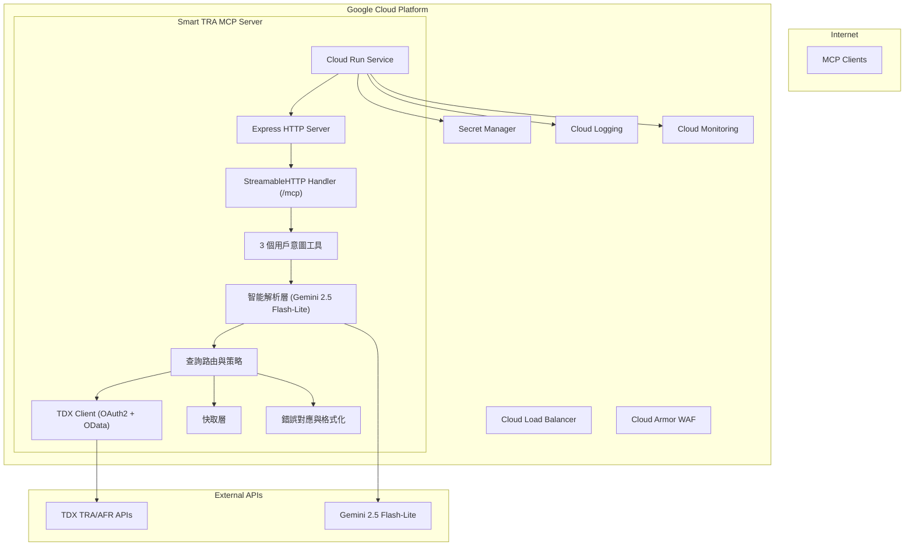

# 產品需求文件 (PRD)：Smart TRA MCP Server

## 概述

### 產品願景

打造一個符合 Model Context Protocol (MCP) 設計哲學、以用戶意圖為中心的台鐵智慧查詢伺服器，稱為「Smart TRA MCP Server」。它以自然語言為介面，整合 TDX 台鐵/阿里山鐵路開放資料，提供班次搜尋、即時動態、票價查詢與出行建議。全面對齊 Shopify Storefront MCP 設計理念：最少工具數、統一參數結構（`query` + `context` 純文字）、一致錯誤處理與可觀測性。

### 目標使用者

- 使用 MCP 兼容客戶端（Claude Desktop、Cursor、n8n 等）的使用者與開發者
- 在 AI 對話中需要查詢台鐵班次、即時動態、票價與轉乘建議的旅運使用者
- 希望在自動化流程（n8n、機器人）中整合台鐵資料的團隊

### 核心原則（MCP Design Philosophy）

- 最多 3–4 個工具；本專案採 3 個工具
- 工具名稱以「用戶意圖」為中心，而非資料表或 API 名稱
- 所有工具僅使用兩個純文字參數：`query`（必填）+ `context`（選填）
- 工具應能串接成邏輯使用旅程（找站 → 查班次/即時 → 出行建議）

## 系統架構



## 工具設計（3 個）

嚴格遵循「用戶意圖命名 + 統一 `query`/`context`」模式。

### 1) `search_trains` — 查班次

- **用戶意圖**：我想查班次/車次/從 A 到 B 的列車（含日期時間）、或查票價、或看目前即時狀態（通勤預設）
- **參數**：
  - `query`（必填）：自然語言，如「明早 8 點台北到台中最快的自強號」「車次 122 的即時位置」「台北到台中票價」
  - `context`（選填）：偏好與補充，如「繁體中文、含 OData 過濾」「回傳最多 5 筆」
- **智能路由（範例）**：
  - 時刻表（每日/定期/指定車次/站別）：`TRA DailyTrainTimetable / GeneralTrainTimetable / GeneralStationTimetable`
  - 即時動態：`TRA StationLiveBoard / TrainLiveBoard`
  - 票價：`TRA ODFare`
  - 阿里山鐵路對應端點（若用戶意圖明確提及 AFR）
- **OData 支援**：解析 `context` 中的關鍵詞，將 `$filter/$select/$orderby/$top` 等轉為查詢參數

### 2) `search_station` — 車站發現與確認

- **用戶意圖**：我要確認用戶說的「站名/代碼」為哪個站，處理模糊與同名站
- **參數**：
  - `query`（必填）：如「松山站」「南港」「嘉義林森」
  - `context`（選填）：如「台鐵優先」「列出候選 3 個」「繁體中文」
- **智能功能**：
  - 以 Gemini + 規則抽取可能站名 → 對照 TDX `Station`/`StationOfLine` 資料 → 產生主結果與備選清單
  - 回傳站碼、所屬線別、行政區資訊、信心分數與是否需要用戶確認

### 3) `plan_trip` — 規劃行程

- **用戶意圖**：基於班次/即時/票價資訊，給我可執行建議（提早到站、候補車次、轉乘方案）
- **參數**：
  - `query`（必填）：如「今晚 9 點從新竹回台中，有沒有推薦班次」
  - `context`（選填）：如「避免區間車」「可轉乘高鐵」「最短時間優先」
- **智能功能**：
  - 若需要，先透過 `search_trains` 取數；結合即時延誤、運行方向、停靠策略，產生清晰建議列表（含風險與替代方案）

## 工具規格（統一輸入結構）

```json
{
  "name": "search_trains",
  "description": "智能列車查詢：依用戶意圖自動在台鐵/阿里山鐵路資料中查詢時刻、即時與票價。",
  "inputSchema": {
    "type": "object",
    "properties": {
      "query": { "type": "string", "description": "自然語言查詢，如：台北到台中明早 8 點的車次" },
      "context": { "type": "string", "description": "偏好與補充，如：繁體中文、結果上限 5、含票價" }
    },
    "required": ["query"]
  }
}
```

```json
{
  "name": "search_station",
  "description": "車站發現與確認：處理模糊站名，輸出站碼、線別與候選清單。",
  "inputSchema": {
    "type": "object",
    "properties": {
      "query": { "type": "string", "description": "站名或模糊描述，如：松山站、南港" },
      "context": { "type": "string", "description": "地區偏好與輸出控制，如：只要台鐵、候選 3 筆" }
    },
    "required": ["query"]
  }
}
```

```json
{
  "name": "plan_trip",
  "description": "出行建議：結合時刻、即時、票價，產出可執行的搭乘建議與替代方案。",
  "inputSchema": {
    "type": "object",
    "properties": {
      "query": { "type": "string", "description": "自然語言需求，如：今晚 9 點新竹→台中推薦班次" },
      "context": { "type": "string", "description": "偏好，如：最短時間、少轉乘、避免區間" }
    },
    "required": ["query"]
  }
}
```

## 智能解析與路由

### 解析模型

使用 Gemini 2.5 Flash‑Lite 做輕量解析，結合規則法（Rule‑Based）作為 fallback，產出下列結構：

```json
{
  "intent": "timetable|live_status|fare|route_search|station_info|advice",
  "entities": {
    "origin": "台北",
    "destination": "台中",
    "date": "2025-08-10",
    "timeWindow": "07:30-09:30",
    "trainNo": "122",
    "station": "松山"
  },
  "preferences": {
    "language": "zh-TW",
    "maxResults": 5,
    "optimize": "fastest|min_transfer|cheapest"
  },
  "confidence": 0.87
}
```

### 路由策略（示意）

| 意圖 | 主要端點 | 附加處理 |
|---|---|---|
| timetable | DailyTrainTimetable / GeneralTrainTimetable / GeneralStationTimetable | 依 `entities` 決定日期/站別/車次；支援 OData |
| live_status | StationLiveBoard / TrainLiveBoard | 站別到離、車次即時位置 |
| fare | ODFare | OD 票價；必要時補全站碼 |
| route_search | （由 timetable + live_status 組合） | 產生候選路徑並排序（時間/轉乘次數）|
| station_info | Station / StationOfLine | 站碼、線別、地理資訊 |
| advice | 上述多端點 | 整理建議、風險、替代方案 |

### 預設模式與優先序

- `search_trains`（預設：通勤即時模式）
  - 時間窗：現在起 60 分鐘
  - 月票車種過濾：依台鐵月票規定，僅可搭乘區間車/區間快車（參考[台鐵月票規定](https://www.railway.gov.tw/tra-tip-web/tip/tip00C/tipC21/view?proCode=8ae4cac3889508e701889af6ea7904e7&subCode=8ae4cac3889508e701889af83c8404e8)）
  - 遲到判斷：到站時間 ≤ 目標時間 + 15 分鐘視為「準時」
  - 顯示「會不會遲到」判斷、下一班倒數、備援 ≥ 2 班、延誤透明
  - 若指定「到達時限（例如 ≤08:30）」則回推最晚上車班次
- `plan_trip`（預設：規劃模式）
  - 同時輸出：最短時間 / 最少轉乘 / 最便宜 三方案（含票價）
  - 假期前後：提示「加開/調整」資訊（若資料不足，標註風險）
- AFR（阿里山森林鐵路）為 opt-in：
  - 僅在 `context` 明示（例如："AFR:true"、"阿里山森林鐵路"）或偵測到關鍵詞（如「奮起湖」「祝山」）時啟用
  - 回覆須註明「已切換 AFR 資料源」
- 月票車種配置化：
  - 預設清單：區間車、區間快車（依台鐵月票規定）
  - 遇不合法車種（如自強號、莒光號）：提示可搭車種清單並自動重算建議
  - 支援 context 覆蓋：如「月票車種=區間,區間快,莒光」（特殊情況）

## 輸入驗證規範

- 統一輸入結構：三個工具皆為 `query`（必填，string）＋ `context`（可選，string）
- `context` 僅接受純文字字串：
  - 若傳入非字串（物件/陣列/number/boolean）→ 回 400 Invalid params
  - 內容淨化：移除 `<script>`、`javascript:`、事件處理屬性（如 `onclick=`）、控制字元（0x00–0x1F, 0x7F）
  - 長度限制：最大 500 字元（超出將截斷）
- `query` 檢查：
  - 必填，最大 1000 字元；超長將截斷
  - 單一詞長度上限 200 字元（防 DoS 字串）
  - 允許 Unicode（中/英/日等），但會移除危險片段（同上）
- 錯誤回應：提供清楚訊息與更正示例，避免使用者誤解必填/型別規則

## 錯誤處理與透明性

- 401/403：TDX 認證或權限問題 → 檢查 Secret 設定與配額
- 416/423/429：頻率與連線限制 → 退避重試，建議調整節流設定
- 4xx（參數錯誤）：提示正確範例（站名/日期格式）
- 5xx：服務暫時不可用 → 回傳誠實透明訊息與備援建議

回應一律提供人讀摘要與（必要時）JSON 結構，方便串接工作流。

## 效能、節流與快取

- Rate limit：外部 API 5 次/分鐘（per key）
  - 策略：令牌桶（5/min），耗盡時隊列最多 10 筆，超出直接快速失敗並回誠實透明建議
  - 退避：指數退避（初始 1s，倍數 2x，上限 16s），附重試‑After 提示
- Access Token：TTL 24 小時（快取與過期前刷新）
- 記憶體快取（可擴展至 Redis）：
  - 時刻表：4 小時 TTL（固定時段、非即時）
  - 票價：24 小時 TTL
  - 站點基本資料：24 小時 TTL
  - 即時動態：1 分鐘 TTL（站別到離 / 車次位置分開快取）
    - 抖動減少：臨界 30 秒內允許重用快取，避免頻繁刷新
- 指標目標：平均 ≤ 1.5s；P95 ≤ 2.5s
- 熱點預熱策略：
  - 通勤時段對前 10 組熱門 OD 預熱「下一班/備援」資料
  - 更新頻率：每 8 小時重新分析熱點清單
  - 預熱觸發：早/晚尖峰前 30 分鐘開始

## 安全與設定

- 認證：TDX OAuth2 Client Credentials；金鑰與密碼置於 Secret Manager
- 傳輸：僅 HTTP/SSE（StreamableHTTP），提供 `/mcp` 單一端點
- 環境變數（示例）：

```bash
GOOGLE_CLOUD_PROJECT=your-project-id
TDX_CLIENT_ID_SECRET=projects/xxx/secrets/tdx-client-id/versions/latest
TDX_CLIENT_SECRET_SECRET=projects/xxx/secrets/tdx-client-secret/versions/latest
GEMINI_MODEL=gemini-2.5-flash-lite
DEFAULT_LANGUAGE=zh-TW
API_TIMEOUT_MS=6000
```

## 部署與可觀測性

- 平台：Google Cloud Run（健康檢查 `/health`，容器 Node.js 18+）
- 監控：Cloud Logging、Cloud Monitoring（成功率、延遲、錯誤型別、快取命中率）
- 告警建議：
  - 成功率 < 95%
  - P95 延遲 > 3s
  - 429/423 比例異常升高（rate limit 與並發受限）
  - Access token 刷新失敗或即將過期（<2% 壽命）

## 測試策略

- 單元：解析器（意圖/實體）、路由器、OData 生成、錯誤對應
- 整合：三工具端到端、即時/時刻/票價組合、快取與節流
- 回歸：樣本查詢集（繁中/英文）與基準比對

## 使用範例

```json
{
  "name": "search_station",
  "arguments": { "query": "松山站", "context": "列出候選 3 個，繁體中文" }
}
```

```json
{
  "name": "search_trains",
  "arguments": { "query": "明早 8 點台北到台中最快的班次", "context": "結果上限 5，含票價" }
}
```

```json
{
  "name": "plan_trip",
  "arguments": { "query": "今晚從新竹回台中有沒有建議", "context": "避免區間，少轉乘" }
}
```

## 驗收標準

### 功能

1. 三工具可用性 100%（名稱、描述、輸入結構一致；僅 `query`+`context`）
2. `search_trains` 能覆蓋：OD/日期的每日時刻表、指定車次、站別時刻、即時到離/位置、OD 票價
3. `search_station` 能產出主結果 + 候選清單 + 信心分數
4. `plan_trip` 能生成可執行建議，包含風險與替代方案

### 非功能

- 平均回應 ≤ 1.5s；P95 ≤ 2.5s；可用性 ≥ 99.5%
- 具備快取與節流；錯誤對應完整且誠實透明
- 文件齊備（PRD/spec/plan/dev-notes），遵循 Doc‑Oriented SDLC

## 未來發展

### Phase 2：基礎轉乘規劃

- 主線↔支線轉乘（平溪、內灣、集集、沙崙線等）
- 跨車種轉乘（月票限制下的最佳路徑）
- 固定緩衝時間策略（主線 15 分、支線 30 分）

### Phase 3：智能轉乘與跨運具

- 即時延誤對轉乘的影響評估
- 跨運具整合（台鐵↔高鐵、台鐵↔捷運）
- 動態轉乘緩衝時間調整

### Phase 4：進階功能

- 使用者偏好學習（常用站、時間窗、轉乘偏好）
- 路線規劃更智能（轉乘權重、第一末班判斷）
- 無障礙轉乘路線與站內導航

---

參考：

- Model Context Protocol 規格、MCP TypeScript SDK
- TDX TRA/AFR API（含 OData）
- Shopify Storefront MCP 設計哲學（3 工具、query+context）
