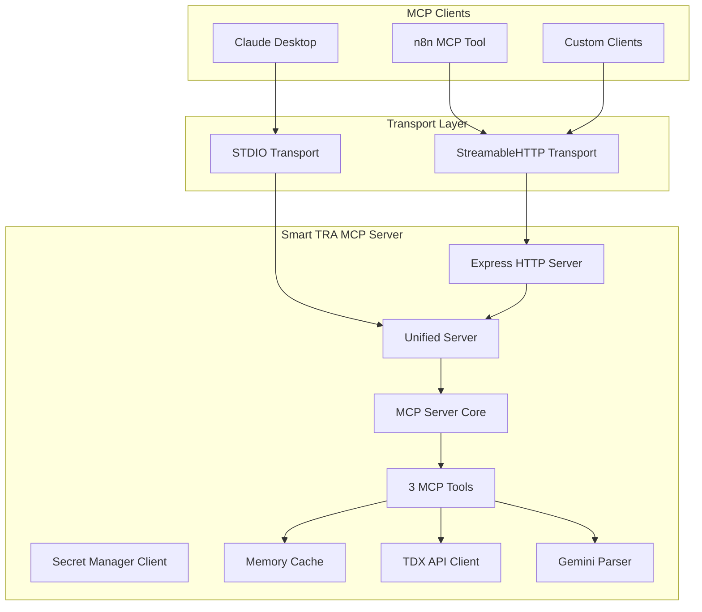

# 技術規格文件（SPEC）：Smart TRA MCP Server

## 1. 概述

本文件定義 `Smart TRA MCP Server` 的技術規格，對齊 PRD（`prd.md`）並落實 MCP 設計哲學：三工具、統一參數（`query` 必填、`context` 可選字串），以通勤優先體驗為核心。

### 1.1 背景與目標

- 背景：現行 TDX/TRA API 眾多，對最終使用者（通勤、旅遊、業務）不直觀。MCP 能以「用戶意圖工具」降低複雜度。
- 目標：
  - 以三工具（`search_station` / `search_trains` / `plan_trip`）覆蓋找站、查班次、規劃行程的完整旅程
  - 支援 STDIO（桌面 AI）與 Streamable HTTP（Web/n8n）雙傳輸
  - 通勤優先（遲到判斷、備援、月票車種限制）與誠實透明錯誤

### 1.2 功能範圍

- `search_station`：站名容錯、主結果＋候選、信心分數、AFR opt-in
- `search_trains`：時刻/即時/票價合一查詢、通勤預設、備援與倒數
- `plan_trip`：三方案（最短/最少轉乘/最便宜）、固定緩衝（主 15 分/支 30 分）、之後考慮即時延誤與跨運具

## 2. 系統架構

### 2.1 整體架構



### 2.2 傳輸模式（STDIO 與 Streamable HTTP）

- STDIO：供桌面客戶端（如 Claude Desktop）連線；低延遲、開發者體驗佳
- Streamable HTTP（SSE+POST）：供 Web/n8n 使用，支援事件流與 JSON 回覆
- 統一進入點：同一組工具處理器，根據傳輸層連線模式差異化封裝

### 2.3 技術選擇與依賴

```json
{
  "runtime": "Node.js 18+ (Container)",
  "language": "TypeScript 5+",
  "platform": "Google Cloud Run",
  "mcp_sdk": "@modelcontextprotocol/sdk@^1.17.1",
  "http_server": "express@^4.18.0",
  "http_client": "axios@^1.6.0",
  "secret_manager": "@google-cloud/secret-manager@^5.0.0",
  "transport": "STDIO + Streamable HTTP"
}
```

### 2.4 實現策略

- 模組化：工具處理器、查詢解析、TDX Client、快取、錯誤處理解耦
- 雙傳輸：同一 `ToolHandlerService` 提供 STDIO/HTTP 兩用 API 介面
- 小步快跑：Phase 1 先完成通勤核心與 `search_station` 容錯

### 2.5 Cloud Run 實現（HTTP/SSE）

- `/health` 健康檢查、`/mcp` 統一 MCP 端點（GET 事件流 / POST 訊息）
- Secret Manager 載入 TDX OAuth2 憑證
- 自動擴縮與日誌/監控整合（Cloud Logging/Monitoring）

## 2. 工具與介面規格

### 2.1 共通輸入結構

- `query`：必填，string，最大 1000 字元；單一詞長度上限 200 字元；允許 Unicode；移除危險片段
- `context`：可選，string，最大 500 字元；僅純文字；移除危險片段
- 僅接受字串類型；若傳入非字串（object/array/number/boolean）→ 回 400 Invalid params

輸入淨化（兩者皆適用）：

- 移除 `<script ...>...</script>`、`javascript:`、HTML 事件屬性（如 `onload=`/`onclick=`）
- 移除控制字元（0x00–0x1F, 0x7F）
- trim 後長度檢查與截斷（超長截斷，不報錯）

### 2.2 工具定義

1) `search_station` — 車站發現與確認（Phase 1）

- 目的：處理模糊/簡稱/錯別字，產出主結果與候選
- 主要輸出欄位：
  - `stationId`、`name`、`line`/`lines`、`region`（如縣市）、`confidence`（0–1）
  - `alternatives[]`（同結構，最多 2–3 筆）
  - `needsConfirmation: boolean`
- Phase 1 能力：
  - 精確/部分比對、常見簡稱字典（如：北車→臺北）
  - 中文優先；AFR 資料 opt-in（僅在 context 明示或關鍵詞時）
- Phase 2 擴充：近似比對、多語別名、索引合併（TRA+AFR）

1. `search_trains` — 查班次（通勤預設，Phase 1）

- 通勤預設（未指定 context 時）：
  - 時間窗：現在起 120 分鐘
  - 月票車種過濾：區間車/區間快車（依台鐵月票規定，見參考連結）
  - 遲到判斷：到站時間 ≤ 目標時間 + 15 分鐘 → 視為準時
  - 顯示：是否會遲到、下一班倒數、備援 ≥ 2 班、延誤透明
  - 可解析到達時限語意（例如「≤08:30」）回推最晚上車班次
- **車次專查功能（已實作）**：
  - 支援車次號碼專查（如「152」、「1234號列車」）
  - 智慧補全：提供相似車次建議與即時預覽
  - 詳細時刻表：整合 TDX SpecificTrainTimetable/DailyTrainTimetable API
  - **即時狀態顯示**：整合 TrainLiveBoard API，顯示：
    - 列車當前位置與狀態（🚈進站中、🚏停靠中、➡️已離站）
    - 誤點資訊（🟢準點、🟡輕微誤點、🔴嚴重誤點）
    - **調整後時間**：根據誤點自動計算預估到站/離站時間
    - 即時資料覆蓋率與下一站預估
- 路由策略：
  - 時刻表：Daily/General/Station timetable（依 `entities`）
  - 即時：StationLiveBoard / TrainLiveBoard
  - 票價：ODFare
- AFR opt-in：context 明示或關鍵詞觸發，回覆需標註資料源切換

1. `plan_trip` — 規劃行程（Phase 2 轉乘、Phase 3 智能）

- 基礎（Phase 2）：
  - 提供「最短時間 / 最少轉乘 / 最便宜」三方案（含票價）
  - 轉乘固定緩衝：主線 15 分、支線 30 分
  - 支援主線↔支線、跨車種轉乘（遵守月票限制）
- 智能（Phase 3）：
  - 考慮即時延誤，動態調整緩衝時間
  - 跨運具（台鐵↔高鐵、台鐵↔捷運）

## 3. 解析與語意規則

### 3.1 語意拆解（適用 `search_trains`/`plan_trip`）

- `intent`: timetable | live_status | fare | route_search | advice
- `entities`: origin | destination | date | timeWindow | trainNo | station
- `preferences`: language | maxResults | optimize（fastest|min_transfer|cheapest）| fareIncluded

### 3.2 月票車種規則

- 預設可搭：區間車、區間快車
- 遇到不合法車種（如自強號、莒光號）
  - 回應：提示可搭清單（區間/區間快），自動重算建議
- context 覆蓋：允許手動指定（如「月票車種=區間,區間快,莒光」），僅在明確需求時生效
- 參考：台鐵月票規定（行政院通勤月票與禁止搭乘列車規定）

## 4. 轉乘規格（分階段）

### Phase 1（MVP）

- `search_trains` 偵測跨線/支線需求時，明確提示「需在 XX 站轉乘」，建議使用 `plan_trip` 取得完整方案

### Phase 2（基礎轉乘）

- `plan_trip` 實作基本轉乘：主線↔支線、跨車種
- 固定緩衝：主線 15 分、支線 30 分
- 至少輸出 2–3 個方案；每方案包含：
  - 轉乘點列表（station、arrivalTrain、departureTrain、transferTime、platform、walkingTime）
  - 總時間、風險等級（低/中/高：≥20/10–20/<10 分）

### Phase 3（智能轉乘）

- 即時延誤對轉乘的影響評估；緩衝動態化
- 跨運具整合與步行距離估算；尖峰時段保險方案

## 5. 節流、快取與熱點策略

### 5.1 節流（Rate Limit）

- 外部 API 5 次/分鐘（per key）：令牌桶 5/min
- 佇列：最多 10 筆；超出快速失敗，回誠實透明建議
- 退避：指數退避（起始 1s，×2，至多 16s）；傳回 Retry-After 建議
- In-flight de-dup：同鍵查詢合併，避免風暴

### 5.2 快取 TTL

- Access Token：24 小時（過期前刷新）
- 時刻表：4 小時（固定時段、非即時）
- 即時動態：1 分鐘（站別到離 / 車次位置分開快取）；臨界 30 秒內重用快取
- 票價：24 小時
- 站點基本資料：24 小時

### 5.3 熱點預熱

- 熱門 OD 上限 10 組；每 8 小時重算
- 預熱內容：通勤相關「下一班/備援」
- 預熱觸發：早/晚尖峰前 30 分鐘

## 6. 錯誤處理與透明性

- 401/403：認證/權限問題 → 檢查 Secret/配額
- 416/423/429：頻率/連線限制 → 退避與使用快取；建議稍後重試
- 4xx（參數錯誤）：清楚訊息與示例（站名/日期/型別）
- 5xx：服務暫不可用 → 誠實透明訊息與替代建議
- 回應格式：一句話結論 + 可展開明細（必要時附 JSON）

## 7. 安全與隱私

- Secret Manager 管理金鑰（TDX OAuth2、其他 API）
- 僅 HTTP/SSE（`/mcp`）
- 不存個資；快取不含可識別資訊

## 8. 可觀測性與指標

- 成功率、平均/分位延遲（P50/P95）、429/423 比例、快取命中率、Token 刷新狀態
- `search_trains`：遲到判斷精度、備援建議採納率
- `search_station`：候選覆蓋率、一次確認率
- `plan_trip`：方案點擊/採納、轉乘失敗率、智能緩衝修正比率

## 9. 測試策略（提要）

- 單元：輸入驗證、月票車種判斷、快取鍵正規化、節流
- 整合：三工具端到端、轉乘 Phase 2 路由、429 降級
- 負載：通勤尖峰 50 并發、速率限制行為

## 10. 參考

- PRD：`prd.md`
- MCP 規格與 SDK
- 台鐵月票規定（行政院通勤月票與禁止搭乘列車規定）：
  - <https://www.railway.gov.tw/tra-tip-web/tip/tip00C/tipC21/view?proCode=8ae4cac3889508e701889af6ea7904e7&subCode=8ae4cac3889508e701889af83c8404e8>
